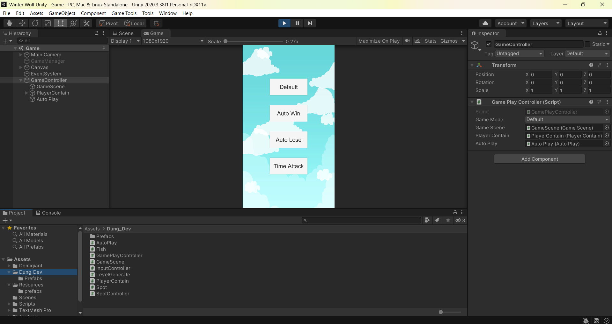
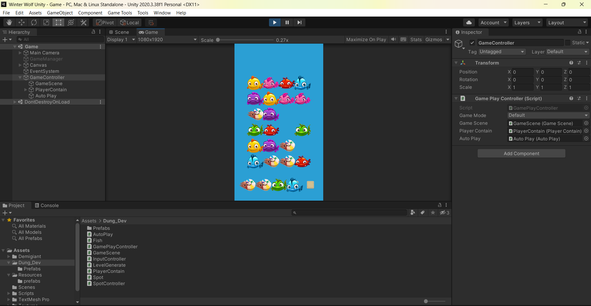

# Winter-Wolf-Test
### 👀Preview:

## Tasks Done ✅
### Task1: Reskin ✅
### Task 2: Change the Gameplay ✅
- Move items from board to bottom cells by tapping
- Items in bottom cells cannot be moved back to board
- Three identical items in bottom cells will be cleared automatically
- Clear the board to win
- Lose if all bottom cells are filled

**Requirements:**
- Initial board items count must be divisible by 3 for each type
- Bottom area contains 5 cells
- Simple winning/losing screens
- Home screen with 'Autoplay' button (0.5s delay per action)
- 'Auto Lose' button on Home screen (0.5s delay per action)

### Task 3: Improve the Gameplay ✅
- Ensure initial board contains all fish types
- Add animations:
  - Item moving from board to cells
  - Items clearing (scale to 0)
- **Time Attack Mode:**
  - New 'Time Attack' button on Home Screen
  - Players can return items from cells back to board
  - No lose condition when cells are filled
  - Lose if board not cleared within 60 seconds

